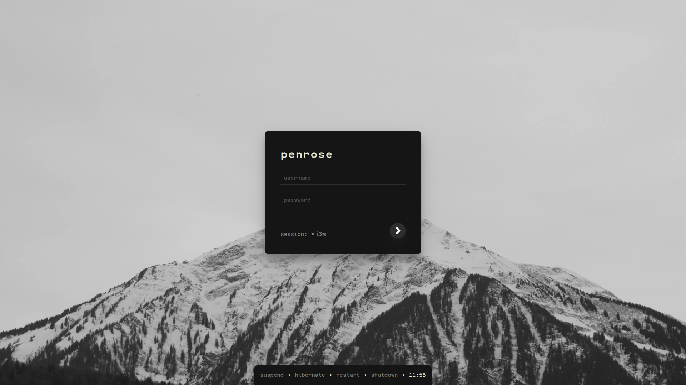

<div align=center>
    <h1>ENKEL</h1>
    A theme for lightdm-webkit2-greeter
</div>

## Preview


## Installation
```
1. download latest release in project's `download` folder
2. copy uncompressed `enkel` folder to /usr/share/lightdm-webkit/themes/
3. update `webkit_theme` option in /etc/lightdm/lightdm-webkit2-greeter to `enkel`
```
## Change Background Image

Location: `/usr/share/lightdm-webkit/themes/enkel/assets/background.jpg`

## [Demo](https://mihranmashhud.github.io/enkel-greeter/)


## Development

Recommended to use `yarn` over `npm`

- `yarn` to install dependencies
- `yarn dev` runs webpack-dev-server
- `yarn build` creates bundle and assets over `/dist`
- `yarn build-demo` creates bundle and assets over `/demo` used by the gh-pages branch

## Credits
- Based on [jellybeans.vim](https://github.com/nanotech/jellybeans.vim)
- Forked from [mihranmashhud/enkel-greeter](https://github.com/mihranmashhud/enkel-greeter) (which is forked from [vndre/enkel-greeter](https://github.com/vndre/enkel-greeter))
- Background photo by [Bora Burri](https://unsplash.com/@borapic)
